<div align="center">



<a href="https://github.com/ConanThe-Barbarian">
  
</a>

<br/>

<a href="https://www.instagram.com/conanfelix007/"></a>
<a href="https://www.linkedin.com/in/conan-felix-2b6389330/"></a>


</div>

---

### 🌌 About me

```ts
const conan = {
  role:     "CEO & Co-founder @ Stellar Syntec",
  building: "GalaxIA — omnichannel helpdesk (WhatsApp, social inbox, automations)",
  studying: "Information Technology Management",
  certified:"IT Technician",
  motto:    "Ship it, measure it, make it stellar.",
};
```

### 🛠️ Tech stack

<div align="center">
  
</div>

### 📊 GitHub stats

<div align="center">
  
  
</div>

<div align="center">
  
</div>

<a href="https://github.com/ashutosh00710/github-readme-activity-graph">
  
</a>

### 🐍 Contribution snake

<picture>
  <source media="(prefers-color-scheme: dark)" srcset="https://raw.githubusercontent.com/ConanThe-Barbarian/ConanThe-Barbarian/output/github-snake-dark.svg"/>
  <source media="(prefers-color-scheme: light)" srcset="https://raw.githubusercontent.com/ConanThe-Barbarian/ConanThe-Barbarian/output/github-snake.svg"/>
  
</picture>


